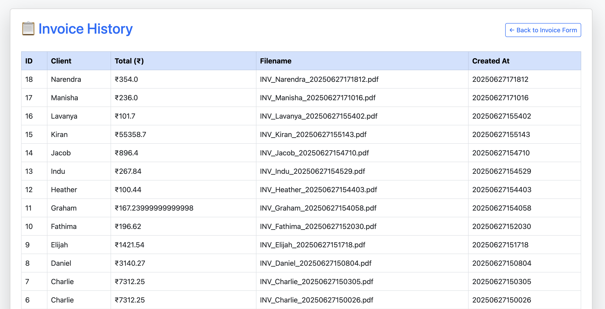
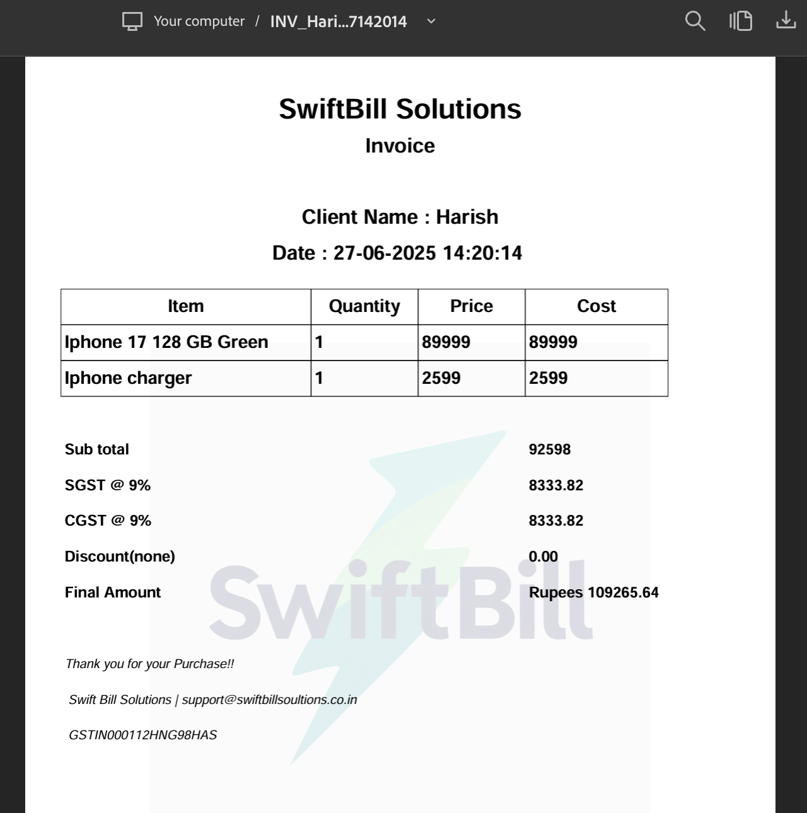
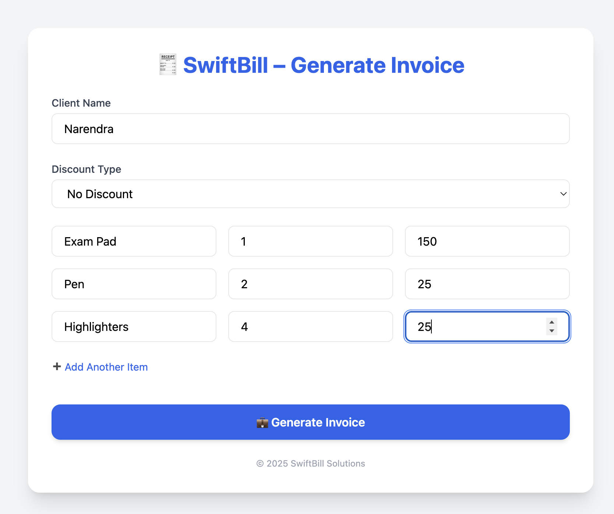

# 💼 SwiftBill – Automated Invoice Generator

SwiftBill is a lightweight web application that allows freelancers and small businesses to **generate professional PDF invoices** instantly. Built with Python and Flask, it offers a clean interface for entering client details and billing data, and it outputs print-ready invoices using the FPDF2 library.

---

## 🌐 Live Demo

🚀 [Try SwiftBill Live](https://swiftbill.onrender.com)

---

## 🚀 Features

- 📝 Input form for client, item, and tax details  
- 🧮 Auto-calculation of totals, tax, and discounts  
- 📄 Generate clean, styled PDF invoices with your branding  
- 🗂️ View history of saved invoices  
- 💾 Store invoice data in a lightweight SQLite database  
- 📧 (Optional) Email invoices directly to clients  
- 🔐 (Optional) Add basic login authentication for secure access

---

## 🛠️ Tech Stack

| Layer         | Tools Used                       |
|--------------|----------------------------------|
| Backend       | Python, Flask                    |
| PDF Engine    | FPDF2                            |
| Database      | SQLite                           |
| Frontend      | HTML, CSS, Bootstrap, Tailwind   |
| Deployment    | Render                           |

---

## 📁 Folder Structure

```txt
SwiftBill/
├── app/
│   ├── static/
│   ├── templates/
│   ├── __init__.py
│   └── routes.py
├── invoices/        # PDF output directory (ephemeral on Render)
├── database/        # SQLite DB file
├── main.py          # Entry point
├── requirements.txt
├── Procfile
└── README.md
```

---

## ⚙️ How to Run Locally

```bash
# 1. Clone the repository
git clone https://github.com/dinesh20121993/SwiftBill.git
cd SwiftBill

# 2. Create a virtual environment & activate
python3 -m venv venv
source venv/bin/activate

# 3. Install dependencies
pip install -r requirements.txt

# 4. Run the app
python main.py
```

Then open your browser and go to:  
http://127.0.0.1:5000

---

## 🖼️ Screenshots

### 🧾 Invoice Entry Form


### 📄 Generated PDF


### 🗂️ Invoice History


---

## 📌 Planned Features

- [ ] Add email invoice functionality
- [ ] Search/filter invoice history
- [ ] Persistent PDF storage using Amazon S3 or Supabase
- [ ] Client authentication for multi-user support

---
## 🔗 Connect With Me

[](https://www.linkedin.com/in/sai-dinesh-mannepalli-30b26323b)

## 🤝 Contributing

Pull requests are welcome. For major changes, please open an issue first to discuss what you would like to change.

---

## 📄 License

This project is open source and available under the [MIT License](LICENSE).

---


